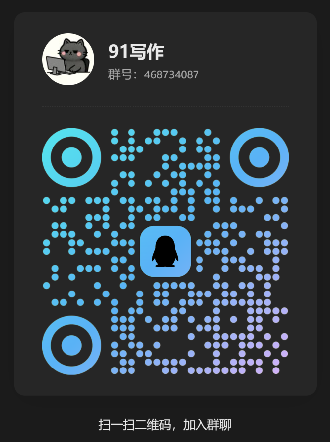

# 🤖 就要创作 - 通用 AI Agent 系统

> 一个灵活的 AI Agent 工作平台，采用 Function Calling 架构，支持任意项目类型。从小说创作到代码开发，由系统提示词控制 Agent 行为。


## 🎉 v0.2.0 重大更新

### 🆕 通用项目系统

**从"小说创作专用" → "通用 AI Agent 系统"**

- ✅ **空白项目**：无预设结构，完全自由
- ✅ **树形文件浏览器**：类似 VSCode 的文件管理
- ✅ **灵活的文件组织**：创建任意文件夹和文件
- ✅ **提示词驱动**：Agent 行为由系统提示词定义
- ✅ **多场景支持**：小说创作、代码开发、文档整理...

### 🔧 通用Agent系统

- ✅ **配置文件驱动**：所有工具和Agent配置都在JSON文件中
- ✅ **动态工具注册**：轻松添加、启用/禁用工具
- ✅ **改进的AI控制**：使用多种策略提高AI的听话程度
- ✅ **更好的错误处理**：详细的错误提示和自动重试
- ✅ **完整的文档**：快速开始、使用指南、API参考

📚 **核心文档**：
- [5分钟快速开始](./docs/quick-start-v0.2.0.md) 👈 **先看这个**
- [配置系统说明](./docs/configuration-system.md) 📋 **理解配置文件的作用**
- [环境变量配置](./docs/env-configuration.md) ⚙️ **配置 API 和推理轮次**
- [系统提示词管理](./docs/system-prompt-management.md) 📝 **了解提示词配置**
- [项目目录迁移指南](./docs/product-directory-migration.md) 🚀 **重要：目录已迁移到 product**

📚 **进阶文档**：
- [通用项目系统说明](./docs/universal-project-system.md) 🆕 **了解新的文件管理**
- [通用Agent系统使用指南](./docs/universal-agent-guide.md)
- [v0.2.0改进说明](./docs/v0.2.0-improvements.md)
- [Web UI 改进文档](./docs/ui-improvements-v2.md) 🎨 **全新的推理过程显示**
- [Web UI 修复文档](./docs/ui-fixes-v3.md) 🔧 **修复函数错误和重复显示**
- [LLM 流式输出修复](./docs/llm-stream-fix.md) 🔧 **修复内容重复显示**
- [AI 提前结束任务修复](./docs/ai-not-completing-tasks-fix.md) 🔧 **修复 AI 不执行任务**
- [结构化推理过程保存](./docs/structured-reasoning-storage.md) 📊 **推理过程结构化存储**
- [对话上下文管理](./docs/conversation-context-management.md) 💬 **AI 如何记住对话**
- [v2 提示词使用指南](./docs/use-v2-prompt.md) 🚀 **让 AI 会续写/修改（强烈推荐）**
- [v1 vs v2 提示词对比](./docs/prompt-comparison-v1-vs-v2.md) 📊 **v2 改进说明**
- [历史对话推理过程渲染](./docs/load-history-reasoning-steps.md) 🔧 **修复刷新后推理过程消失**
- [问题排查指南](./docs/troubleshooting-guide.md) 🆘 **遇到问题看这里**

## 教程文档
https://wzkmyww7j1.feishu.cn/docx/NjJTde6AhoL4jHxB8zxcBG4Gn3b?from=from_copylink

## 推荐 大模型 API 聚合平台 91API
https://api.91hub.vip/

## 平台官网
https://cz.91hub.vip

## 社群&公众号

<div align="center">
  
  
</div>

<div align="center">
  <p><strong>QQ交流群</strong> &nbsp;&nbsp;&nbsp;&nbsp;&nbsp;&nbsp;&nbsp;&nbsp;&nbsp;&nbsp;&nbsp;&nbsp; <strong>关注公众号</strong></p>
</div>


## ✨ 核心特性

### 🧠 智能 AI Agent
- **ReAct 架构**：AI 自主推理和决策，不需要预设流程
- **动态上下文注入**：AI 自动读取大纲、人物、世界观，确保内容一致性
- **Function Calling**：使用最新的 Function Calling 技术，更稳定可靠

### 🎨 灵活的提示词系统
- **双层提示词**：系统级 + 项目级，灵活控制
- **Web UI 编辑**：直接在界面中修改提示词，实时生效
- **智能读取**：AI 根据任务需求自主决定是否读取提示词

### 📝 强大的创作能力
- **长文本生成**：支持 3000+ 字章节一次性生成
- **多种风格**：遮天、现实主义、爽文等各种风格
- **文件版本历史**：每次修改自动备份，可随时回退

### 🎯 直观的 Web 界面
- **三栏布局**：文件树 + 预览区 + AI 助手
- **多标签管理**：同时打开多个文件
- **文件引用**：输入 `@` 快速引用项目文件
- **实时流式输出**：实时查看 AI 思考和创作过程

### 💾 完善的项目管理
- **多项目支持**：管理多个小说项目
- **7 种文件夹**：人物设定、世界观设定、章节内容、大纲、灵感记录、设定资料、创作笔记
- **自动索引**：每个文件夹自动生成 index.md
- **文件重命名**：点击编辑按钮即可重命名

## 🚀 快速开始

### 📋 前置要求

- Node.js 18+ 
- pnpm (推荐) 或 npm
- OpenAI API Key 或兼容的 API

### ⚙️ 安装步骤

1. **安装依赖**
   ```bash
   pnpm install
   # 或
   npm install
   ```

2. **配置环境变量**
   ```bash
   cp env.example .env
   ```
   
   编辑 `.env` 文件：
   ```env
   # API 配置
   API_KEY=your_api_key_here
   API_BASE_URL=https://api.openai.com/v1
   MODEL_NAME=gpt-4
   
   # 服务器配置
   PORT=3000
   ```

4. **启动服务**
   ```bash
   pnpm run web
   ```

5. **打开浏览器**
   ```
   访问 http://localhost:3000
   ```

## 📖 使用指南

### 创建新项目

1. 点击侧边栏的 **"+ 新建"** 按钮
2. 输入项目名称（如："龙王归来"）
3. 系统会自动创建项目结构和 `创作提示词知识库.md`

### 编辑提示词

#### 项目级提示词
1. 点击右上角 **"⚙️ 提示词设置"** 按钮
2. 切换到 **"项目提示词"** 标签
3. 编辑内容，点击保存

#### 系统级提示词
1. 点击右上角 **"⚙️ 提示词设置"** 按钮
2. 切换到 **"系统提示词"** 标签
3. 谨慎修改，点击保存需要确认

### 创作章节

**方式 1：对话创作**
```
你：写第三章，要遮天的感觉，约3000字

AI：
📂 正在查看文件列表
📖 正在读取《创作提示词知识库.md》
📖 正在读取《故事大纲》
📖 正在读取《第二章》
📖 正在读取《主角设定》
✍️ 正在创作《第三章-xxx》（章节内容）
```

**方式 2：引用文件**
```
你：@第二章 续写第三章
```

### 管理文件

- **查看文件**：点击文件名
- **编辑文件**：在预览区修改，点击保存
- **重命名**：点击"编辑"按钮
- **删除文件**：点击"删除"按钮
- **查看历史**：点击"历史"按钮

## 📁 项目结构

```
jiuyaochuangzuo/
├── 📄 server.js                    # 服务器入口
├── 📂 config/                      # 🆕 配置文件
│   ├── tools.json                 # 工具配置
│   └── agent-config.json          # Agent配置
├── 📂 public/                      # 前端资源
│   ├── index.html                 # 主界面
│   ├── app.js                     # 前端逻辑
│   ├── style.css                  # 样式
│   ├── favicon.png                # 图标
│   └── static/                    # 静态资源
├── 📂 src/                         # 后端源码
│   ├── universal-agent.js         # 🆕 通用Agent类
│   ├── tool-registry.js           # 🆕 工具注册器
│   ├── function-calling-agent.js  # AI Agent 核心
│   ├── react-agent.js             # ReAct Agent
│   ├── project-manager.js         # 项目管理
│   ├── context-manager.js         # 上下文管理
│   ├── conversation-manager.js    # 对话管理
│   └── tools/                     # 工具集
│       ├── file-operations.js     # 文件操作
│       └── novel-writing/         # 创作工具
│           ├── index.js           # 长文本生成
│           └── revise.js          # 文件修订
├── 📂 prompts/                     # 系统提示词
│   ├── novel-writing-improved.md  # 🆕 改进的提示词
│   └── novel-writing-function-calling.md
├── 📂 examples/                    # 示例代码
│   └── universal-agent-demo.js    # 🆕 使用示例
├── 📂 product/                     # ⭐ 项目数据（自动生成，统一存储目录）
│   └── [项目名]/
│       ├── 项目知识库.md 🆕        # 用户可编辑的项目规则（自动生成）
│       ├── README.md               # 项目说明（自动生成）
│       ├── project-config.json     # 系统配置（自动管理）
│       ├── conversation-history.json # 对话历史（自动管理）
│       └── [用户自定义文件夹和文件]  # 根据需要创建
└── 📂 docs/                        # 文档
    ├── quick-start-v0.2.0.md      # 🆕 快速开始
    ├── universal-agent-guide.md   # 🆕 使用指南
    └── v0.2.0-improvements.md     # 🆕 改进说明
```

## 🛠️ 可用命令

```bash
# 开发模式（热重载）
pnpm run web:dev

# 生产模式
pnpm run web

# 监听代码变化（不监听小说内容）
# 修改 src/, public/, prompts/ 会自动重启
```

## 🎯 核心工具

AI 可以调用以下工具完成任务：

| 工具 | 功能 | 使用场景 |
|-----|------|---------|
| `generate_long_content` | 生成长文本（3000+字） | 章节创作、人物设定 |
| `save_file` | 保存短文本（<400字） | 灵感记录、笔记 |
| `read_file` | 读取文件 | 了解上下文 |
| `list_files` | 列出文件 | 查看项目结构 |
| `update_file` | 更新文件 | 修改已有内容 |
| `append_to_file` | 追加内容 | 补充章节 |
| `move_file` | 移动文件 | 文件分类整理 |
| `view_revision_history` | 查看历史 | 版本回溯 |

## 🎨 提示词知识库

每个项目都有独立的 `创作提示词知识库.md`，可以定义：

### 📝 章节正文风格
```markdown
## 📝 章节正文创作提示词

### 风格：爽文
- 节奏要快，一章一个小高潮
- 主角要强，打脸要狠
- 爽点要密集，不拖沓

### 格式要求
- 每章 3000-5000 字
- 采用网文惯用的"段落+空行"格式
```

### 👤 人物设定格式
```markdown
## 👤 人物设定提示词

### 标准格式
- **姓名**：
- **年龄**：
- **外貌**：
- **性格**：
- **背景**：
- **能力**：
- **目标/动机**：
```

## 🔧 技术栈

- **后端框架**: Express.js
- **AI 框架**: LangChain.js
- **AI 架构**: ReAct + Function Calling
- **前端**: Vanilla JavaScript (无框架)
- **样式**: 纯 CSS（响应式设计）
- **Markdown**: Marked.js
- **Diff 可视化**: Diff2Html

## 🌟 高级功能

### 文件版本历史

每次修改文件都会自动备份：
- 备份文件：`原文件名.backup-时间戳.md`
- 历史记录：`原文件名.revision-history.json`
- 可通过"历史"按钮查看所有版本

### 文件引用 (@)

在对话框输入 `@` 可快速引用项目文件：
- 输入 `@` 触发文件选择器
- 支持搜索过滤
- 选中后自动插入文件内容到对话

### 提示词编辑

直接在 Web UI 编辑提示词：
- **项目提示词**：控制该项目的创作风格
- **系统提示词**：控制 AI 的工具调用行为

## 📊 AI 工作流程

```
用户输入
    ↓
AI 分析任务
    ↓
Phase 1: Context Discovery（上下文发现）
    - list_files(大纲)
    - list_files(章节内容)
    - list_files(人物设定)
    ↓
Phase 2: Intelligent Retrieval（智能检索）
    - read_file(创作提示词知识库.md)  ← 了解风格
    - read_file(大纲)                  ← 了解框架
    - read_file(前一章)                ← 确保连贯
    - read_file(主要人物)              ← 确保一致
    ↓
Phase 3: Creation（创作）
    - generate_long_content(...)
    ↓
完成！
```

## 🚢 部署方式

### 方式 1：源代码分发

打包项目：
```bash
zip -r jiuyaochuangzuo-v1.0.0.zip . \
  -x "node_modules/*" \
  -x ".git/*" \
  -x "product/*" \
  -x ".env"
```

用户使用：
1. 解压
2. `pnpm install`
3. 配置 `.env`
4. `pnpm run web`

### 方式 2：Docker 部署

创建 `Dockerfile`：
```dockerfile
FROM node:18-alpine
WORKDIR /app
COPY package*.json ./
RUN npm install
COPY . .
EXPOSE 3000
CMD ["node", "server.js"]
```

使用：
```bash
docker build -t jiuyaochuangzuo .
docker run -p 3000:3000 -v $(pwd)/.env:/app/.env jiuyaochuangzuo
```

## 🤝 贡献

欢迎提交 Issue 和 Pull Request！

### 开发流程
1. Fork 项目
2. 创建特性分支 (`git checkout -b feature/AmazingFeature`)
3. 提交更改 (`git commit -m 'Add some AmazingFeature'`)
4. 推送到分支 (`git push origin feature/AmazingFeature`)
5. 提交 Pull Request

## 📄 许可证

MIT License - 详见 [LICENSE](LICENSE) 文件

## 🎉 致谢

- [LangChain.js](https://github.com/langchain-ai/langchainjs) - AI 应用开发框架
- [OpenAI](https://openai.com/) - AI 模型提供商
- [Marked.js](https://marked.js.org/) - Markdown 解析器
- [Diff2Html](https://github.com/rtfpessoa/diff2html) - Diff 可视化工具

---

<div align="center">

**开始你的 AI 小说创作之旅吧！** 🚀✨

[官网](https://cz.91hub.vip) · [文档](https://wzkmyww7j1.feishu.cn/docx/NjJTde6AhoL4jHxB8zxcBG4Gn3b?from=from_copylink) · [问题反馈]([ponysb/91Writing at agentic](https://github.com/ponysb/91Writing/issues))

</div>
